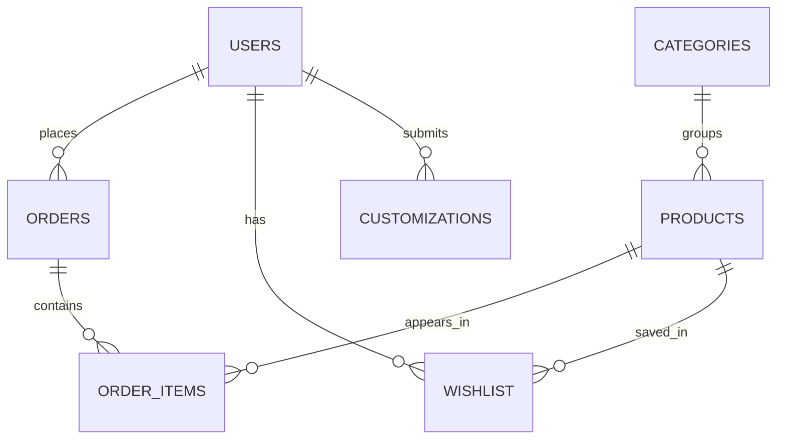

# Buneko Nepal: Full Project Documentation

This document is a presentation-ready technical overview of the Buneko Nepal e-commerce platform, including frontend, backend, and database architecture.

## 1. Project Overview

Buneko Nepal is a full-stack flower e-commerce platform with:

- Public storefront for browsing products and content
- Customer authentication, cart, wishlist, and order placement
- Admin dashboard for managing products, categories, orders, customers, and custom requests
- MySQL-backed persistent data layer
- Optional integrations for image upload, payments, and email notifications

## 2. High-Level Architecture

```text
Frontend (React + TypeScript + Vite)
	|
	| HTTP/JSON + JWT Bearer Token
	v
Backend API (Node.js + Express)
	|
	| SQL via mysql2 pool
	v
Database (MySQL 8 / InnoDB)
```

## 3. Frontend Documentation

### 3.1 Tech Stack

- React 18 + TypeScript
- Vite build/dev server
- Tailwind CSS + shadcn/ui component system
- React Router for page routing
- TanStack React Query for server-state management
- React Hook Form + Zod for form handling and validation
- Context API for auth and cart state

### 3.2 Frontend Folder Structure

- `src/main.tsx`: app bootstrap
- `src/App.tsx`: providers and route definitions
- `src/pages/`: page-level views (public + dashboard/admin)
- `src/components/`: reusable UI, home sections, layout, protected route wrapper
- `src/contexts/`: `AuthContext` and `CartContext`
- `src/lib/api.ts`: centralized API client
- `src/hooks/`: shared hooks (session, mobile, toast)

### 3.3 Frontend Routing

Public routes include:

- `/`, `/about`, `/services`, `/contact`
- `/products`, `/products/:id`
- `/content`, `/cart`, `/login`, `/signup`

Protected routes include:

- `/dashboard/*` (customer role)
- `/admin/*` (admin role; superadmin is also permitted by backend authorization logic)

### 3.4 Frontend State Management

- **Auth state**: handled in `AuthContext` using token + user stored in `localStorage`
- **Cart state**: handled in `CartContext`, persisted in `localStorage`
- **Server state**: handled by React Query and API fetches
- **Session behavior**: periodic user refresh checks to keep session info updated

### 3.5 Frontend-to-Backend Integration

- API base URL is read from `VITE_API_URL` and falls back to `http://localhost:5000/api`
- `Authorization: Bearer <token>` is attached for authenticated requests
- 401/403 error handling is centralized in the API client

## 4. Backend Documentation

### 4.1 Tech Stack

- Node.js + Express
- MySQL driver: `mysql2/promise`
- JWT auth (`jsonwebtoken`) + password hashing (`bcryptjs`)
- Security middleware: Helmet, CORS, rate limiting
- Validation: `express-validator`
- Upload support: Multer + Cloudinary utility
- Optional payment support: Stripe
- Optional email support: Nodemailer

### 4.2 Backend Folder Structure

- `server/src/index.js`: API bootstrap and middleware pipeline
- `server/src/config/database.js`: pool config and DB/table initialization helpers
- `server/src/routes/`: route modules grouped by domain
- `server/src/controllers/`: business logic per domain
- `server/src/middleware/`: auth and upload middleware
- `server/src/database/`: schema, migration, seed, superadmin bootstrap scripts
- `server/src/utils/`: cloudinary/email/validation utilities

### 4.3 API Modules (Route Groups)

- `/api/auth`: register, login, logout, current user, token refresh
- `/api/products`: product browse + admin CRUD
- `/api/categories`: category browse + admin CRUD
- `/api/orders`: create order, user order history, admin order management
- `/api/users`: profile and admin user operations
- `/api/customizations`: custom bouquet/request flow
- `/api/wishlist`: wishlist operations
- `/api/contents`: social/content links
- `/api/dashboard`: admin metrics and dashboard data
- `/api/payments`: Stripe checkout session creation
- `/api` (customer routes): customer-specific endpoints

### 4.4 Auth and Authorization

- JWT-based authentication with configurable expiry
- Roles: `customer`, `admin`, `superadmin`
- Route-level role guards with middleware
- Customers self-register; admin/superadmin are created operationally (scripts/seed)

### 4.5 Backend Security

- CORS allowlist for local frontend hosts
- Rate limiting on `/api/*`
- Helmet security headers
- Input validation middleware
- Parameterized SQL queries through `mysql2`

## 5. Database Documentation

Schema source: `server/src/database/schema.sql`

### 5.1 Database Engine and Conventions

- MySQL 8+ with InnoDB
- Charset/collation: `utf8mb4` / `utf8mb4_unicode_ci`
- Primary keys: auto-increment integer IDs
- Foreign keys enforce referential integrity

### 5.2 Core Tables

1. `users`
- User identity, auth, role, profile fields, active status

2. `categories`
- Product category master data

3. `products`
- Product catalog with category FK and stock

4. `contents`
- Marketing/social media links

5. `orders`
- Order header, payment status, shipping and optional geo-coordinates

6. `order_items`
- Order line items with quantity and price snapshot

7. `wishlist`
- User-product mapping for favorites (unique per user/product)

8. `customizations`
- Customer custom order requests with quote/status lifecycle

### 5.3 Relationship Summary

- `products.category_id -> categories.id`
- `orders.user_id -> users.id`
- `order_items.order_id -> orders.id`
- `order_items.product_id -> products.id`
- `wishlist.user_id -> users.id`
- `wishlist.product_id -> products.id`
- `customizations.user_id -> users.id`

### 5.4 ERD (Presentation-Friendly)



## 6. End-to-End Functional Flows

### 6.1 Authentication Flow

1. User signs up/logs in from frontend form
2. Backend validates input and credentials
3. JWT token is returned and stored client-side
4. Protected routes use role checks in frontend + backend

### 6.2 Product and Cart Flow

1. Frontend fetches categories/products from API
2. User adds items to cart (local state + localStorage)
3. Cart page collects shipping/contact details

### 6.3 Order Flow

1. Frontend sends order payload to `/api/orders`
2. Backend creates order + order items
3. Product stock is updated by backend logic
4. User and admin can track order status in dashboards

### 6.4 Customization Request Flow

1. Customer submits custom request
2. Admin reviews and adds notes/quoted price
3. Status evolves (pending -> reviewing -> quoted -> accepted/rejected/completed)

### 6.5 Optional Payment Flow (Stripe)

1. Frontend requests checkout session
2. Backend creates Stripe checkout session
3. Client redirects to Stripe-hosted checkout URL

## 7. Environment and Setup

## 7.1 Prerequisites

- Node.js (18+ recommended)
- MySQL (8+)

### 7.2 Backend Setup

```bash
cd server
npm install
```

Create `server/.env` with at least:

```env
PORT=5000
NODE_ENV=development
DB_HOST=localhost
DB_USER=root
DB_PASSWORD=your_mysql_password
DB_NAME=buneko_blooms
DB_PORT=3306
JWT_SECRET=change-me-in-production
JWT_EXPIRE=7d
FRONTEND_URL=http://localhost:8080
```

Optional envs for integrations:

- Cloudinary: `CLOUDINARY_CLOUD_NAME`, `CLOUDINARY_API_KEY`, `CLOUDINARY_API_SECRET`
- Email: `EMAIL_USER`, `EMAIL_PASS`
- Stripe: `STRIPE_SECRET_KEY`, `STRIPE_PUBLISHABLE_KEY`

Run backend:

```bash
npm run db:migrate
npm run db:seed
npm run db:create-superadmin
npm run dev
```

### 7.3 Frontend Setup

```bash
# from project root
npm install
npm run dev
```

Optional frontend env:

```env
VITE_API_URL=http://localhost:5000/api
```

Frontend dev server runs on port 8080 (`vite.config.ts`).

## 8. Testing and Quality

- Frontend test runner: Vitest + Testing Library
- Current sample test exists in `src/test/example.test.ts`
- Commands:

```bash
npm test
npm run test:watch
```

## 9. Demo Credentials (If Seeded)

- Admin: `admin@buneko.com` / `admin123`
- Superadmin: `superadmin@buneko.com` / `superadmin123` (created via script)

Change all default credentials before production use.

## 10. Presentation Talking Points

Use this sequence for your demo:

1. Explain architecture layers (React -> Express -> MySQL)
2. Show customer flow: browse -> cart -> place order
3. Show authentication and role-based dashboard separation
4. Show admin flow: product/order/category management
5. Highlight database integrity with foreign key relationships
6. Mention optional integrations (Stripe, Cloudinary, email)
7. Close with security features and scalability readiness

## 11. Known Notes

- `server/ENV_SETUP.md` shows `PORT=3000`, while backend code defaults to `5000` when `PORT` is not set.
- Set `PORT` explicitly in `server/.env` to avoid confusion.

##